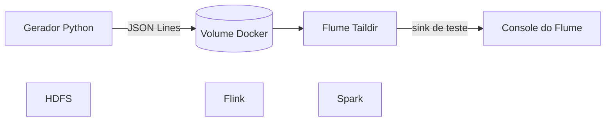

# Semana 1 — arquitetura, ambiente, gerador e Flume

## Objetivo

Demonstrar Flume, Flink, Spark e HDFS em execução, o gerador Python criando JSON
continuamente e o Flume capturando cada linha e enviando-a ao sink logger.

## Arquitetura do checkpoint



HDFS, Flink e Spark sobem para provar o setup. A integração ao HDFS e os jobs
de processamento ficam para as semanas seguintes.

## Executar no Windows com WSL 2

Abra o Docker Desktop. No terminal Ubuntu/WSL, dentro do projeto, execute:

```bash
docker compose pull
docker compose build flume
docker compose up -d
docker compose ps
```

O primeiro download é grande. Todos os serviços devem aparecer como ativos.

## Evidências

```bash
docker compose logs --tail=5 generator
docker compose logs -f flume
```

O primeiro comando mostra objetos JSON. O segundo deve mostrar eventos do Flume
contendo o mesmo JSON. Use `Ctrl+C` para sair dos logs.

Interfaces web:

- Flink: http://localhost:8081
- Spark: http://localhost:8080
- HDFS NameNode: http://localhost:9870

Verificação automática no WSL:

```bash
bash scripts/check-week1.sh
```

## Roteiro de demonstração

1. Mostrar o diagrama.
2. Executar `docker compose ps`.
3. Abrir as interfaces de Flink, Spark e HDFS.
4. Mostrar os logs JSON do gerador.
5. Mostrar os eventos recebidos pelo Flume.
6. Explicar que `TAILDIR` acompanha novas linhas e guarda a posição de leitura.
7. Explicar que o channel de memória e o sink logger são apenas para o teste.

Parar sem apagar dados: `docker compose down`.

Para descartar todo o estado: `docker compose down -v`. Este último comando
apaga os volumes do laboratório.
